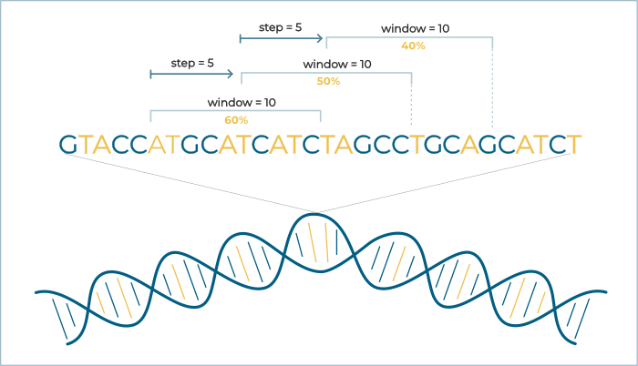
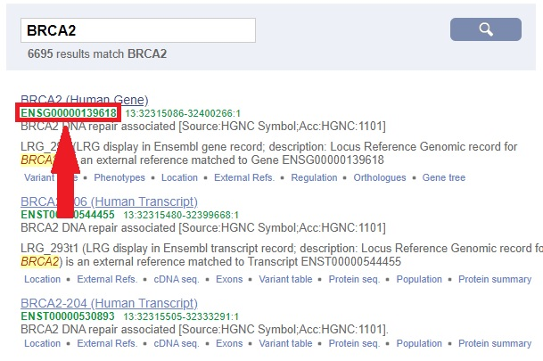

# ATPercent    

## Getting Started

  Please make sure that you have:

  -  [Node.js](http://www.dropwizard.io/1.0.2/docs/) istalled. Since _npm_ has been used for managing dependencies, this is the recommended go-to package manager.

-  [Angular CLI](https://github.com/angular/angular-cli#installation) installed globally:

`npm install -g @angular/cli`

- all the dependecies needed:

run `npm install` int the project folder

 
To run a dev server use `ng serve` command and navigate to `http://localhost:4200/` in your browser - any local changes will be automatically updated.
 

You can also visit [ginolanetti.github.io/ATPercent-ng-app](https://ginolanetti.github.io/ATPercent-ng-app/) to preview app.

  
  

## Built With

  

-  [Angular 8](https://angular.io/) - The web framework

-  [NGXS](https://www.ngxs.io/) - State management library and pattern

- [canvasJS](https://canvasjs.com/) - JavaScript chart library


  

## Quick how to

DNA sequences consist of four types of nucleotides (A/T/G/C). Differences in A/T and G/C content along the sequence have influence on its physicochemical properties. This app enables the user to check how A/T content changes along the given DNA sequence and to compare A/T content profiles between multiple sequences. App renders line plots based on data provided in the [FASTA](https://en.wikipedia.org/wiki/FASTA_format) text file or on sequence's ID from [Ensembl](https://www.ensembl.org/index.html) database. To start analyzing, simply choose new plot tab and enter the data drawing upon example diagram.

 
  


 If you are not familiar with FASTA files or you have no idea where to get your sequences from,try copying those to a new .txt file:
 
```
>sequence 1
gactagctagcgcgcgatagcgcatcgagcactagcagcgatcatcgactagcatcgagctagcggactagctacgagcgagcgatcgc
>sequence 2
cgatcgatcagctacgatcagctacgatcagctagcatcgatcagctacgatcgactagcatcaatactagtatcatatcgatccgcgc
>sequence 3
ggctcagtcgatcgatcgatatatcgatattatacgcgatcgatcagctacgatcagcagctagcatcagctacgcagcctacgatca
```

As you can see, each sequence has its own label (starting with '>' sign) and four types of letters A/T/G/C corresponding with each of the nucleotides of the DNA. Try changing the sequence file and check the different outputs.

Second option is to upload a sequence from [Ensembl](https://www.ensembl.org/index.html) database. Each sequence has its own ID in the database. Search for a genetic element of interest and copy its ID (see image below) to the ID field in the app. Then, download the sequence and generate your chart.

After uploading the file you need to type in:


- window length - number of letters you want to use to count AT% in a single step from

- step - number of letters you want to move forward after each AT% count


Then, the app renders a plot with position of the beginning of each window on X axis and AT% on Y axis. If this is still confusing, take a look at the diagram below: 





Rendered charts are interactive - you can zoom into area of interest, pan the whole chart and turn on/off each of the sequences' plots (just click the legend above the chart). You can also download your chart as a .png/.jpeg file.


